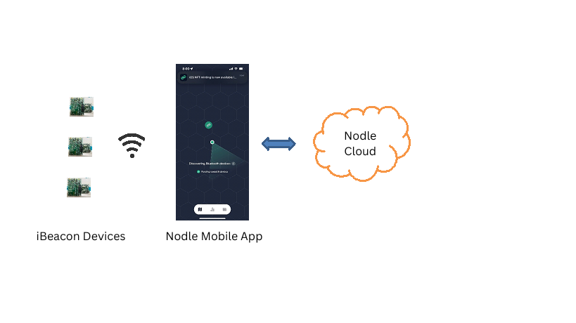
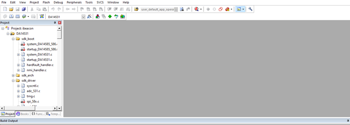
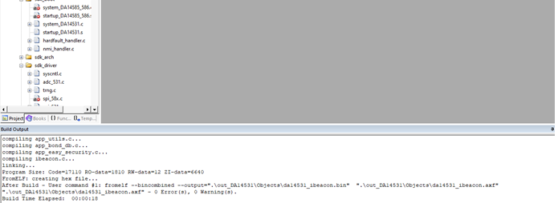
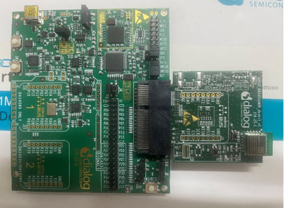
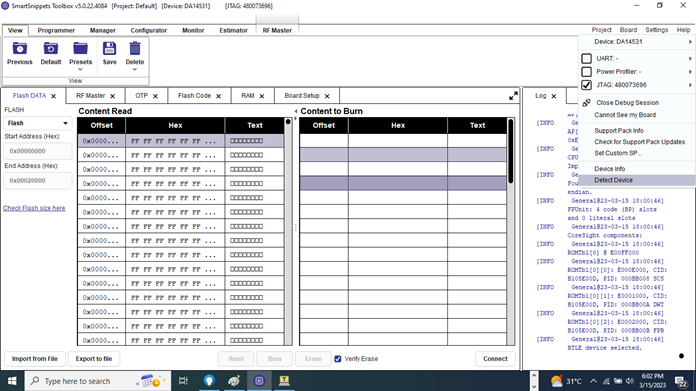
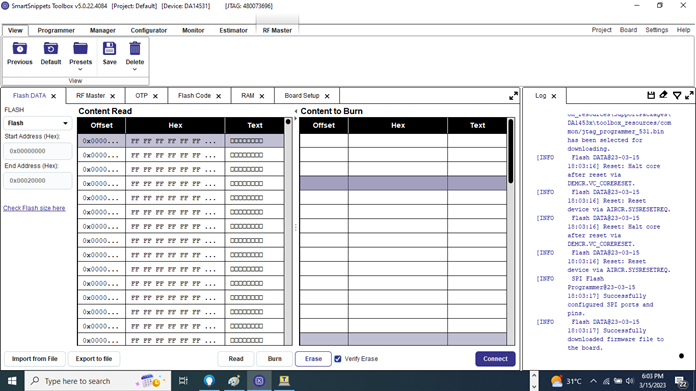
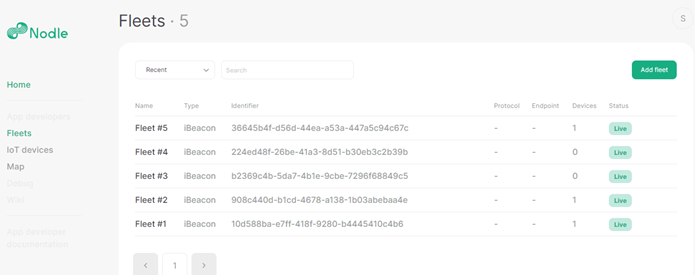

# 1. Introduction

This document provides the instructions to flash iBeacon firmware on a Dialog DA14531 Dev Kit and communicate to the Nodle Cloud. It also describes how to obtain the iBeacon information from the Nodle Cloud.

# 2. Pre-Requisites

The following are required for this project

1. Dialog DA14531MOD-00DEVKT-P Module Development Kit - Pro

2. Dialog SmartSnippets Toolbox (Version used: 5.0.22.4084)

3. Python (Version used: 3.10.8)

4. Nodle Mobile App (iOS or Android)

5. DA14531 SDK 6.0.16.1144

6. Keil µVision V5.35.0.0

Dialog SmartSnippets Toolbox and Keil µVision needs to be installed in the machine to which the Dialog DA14531 Development Kit is connected. Python needs to be installed in the machine in which the Python Script is executed.

Once SmartSnippets Toolbox is installed, add SmartSnippetsToolbox.exe folder location to the PATH environment variables. This will help to launch SmartSnippetsToolbox.exe from any location.

Connect the Dialog Development Kit to a Windows PC to power up the development kit.

# 3. Nodle Beacon Network Diagram

1. Device – This is currently the Dialog DA14531 Development Kit

2. Beacon Detector – This is the Nodle mobile application which detects the iBeacon and relays it to the Nodle Cloud. The Nodle mobile application adds other attributes to the beacon like Accuracy, Altitude, Location details, etc.

3. Nodle Cloud – Nodle Cloud receives the beacon information from the Nodle Mobile App and stores it in its database. It also provides APIs to access the beacon information.

# 4. iBeacon Firmware

The DA14531_ibeacon_project project implements an iBeacon on a Dialog 14531 Development Kit. It uses the Dialog 6.0.16.1144 SDK.

The following are the steps to compile the code.

1. Download Dialog 6.0.16.1144 SDK and unzip it in any folder.

2. Install Keil µVision and when prompted, point to the Dialog 6.0.16.1144 SDK location.

3. Unzip DA14531_ibeacon_project.zip on any folder.

4. Navigate to project_environment folder and double click on ibeacon.uvprojx. This will open the project in Keil µVision.

5. Build the project using Project->Build Target.

7. The firmware binary da14531_ibeacon.bin will be stored in DA14531_ibeacon_project\project_environment\out_DA14531\Objects directory.

8. The following sections describe the procedure to flash the firmware.

# 5. Dialog DA14531MOD-00DEVKT-P setup

The SWCLK, SWDIO and RST need to be connected in order to flash the Development Kit. URX and UTX connection is required if UART communication with the PC is desired.

# 6. Programming the DA14531MOD on Development Kit

## 6.1 Erasing the flash

Launch SmartSnippets Toolbox. Select Board->Detect Device in order to detect the Development Kit.

Erase the flash by clicking on Connect and then Erase.

This will erase the flash.

## 6.2 Programming the iBeacon UUID, Major and Minor No

The following command needs to be executed to program the iBeacon UUID, Major and Minor Nos to the flash. This commands writes the UUID, Major and Minor No to the flash location 0x10000.

iBeacon UUID (16 Bytes) - 10D588BAE7FF418F9280B4445410C4B6

Major No (2 Bytes) – 0101

Minor No (2 Bytes) - 0002

480073696 is the jtag id and is labelled on the Dialog 14531 Development Kit.

SmartSnippetsToolbox.exe -type spi -chip DA14531 -jtag 480073696 -cmd write_field -offset 0x10000 -data 10D588BAE7FF418F9280B4445410C4B601010002

**Output**

	Launching SmartSnippets Toolbox v5.0.22.4084
	Command line arguments:
	-type spi -chip DA14531 -jtag 480073696 -cmd 	write_field -offset 0x10000 -data 	10D588BAE7FF418F9280B4445410C4B601010002

	Found SW-DP with ID 0x0BC11477
	Scanning AP map to find all available APs
	AP[1]: Stopped AP scan as end of AP map has been reached
	AP[0]: AHB-AP (IDR: 0x04770031)
	Iterating through AP map to find AHB-AP to use
	AP[0]: Core found
	AP[0]: AHB-AP ROM base: 0xE00FF000
	CPUID register: 0x410CC601. Implementer code: 	0x41 (ARM)
	Found Cortex-M0 r0p1, Little endian.
	FPUnit: 4 code (BP) slots and 0 literal slots
	CoreSight components:
	ROMTbl[0] @ E00FF000
	ROMTbl[0][0]: E000E000, CID: B105E00D, PID: 	000BB008 SCS
	ROMTbl[0][1]: E0001000, CID: B105E00D, PID: 000BB00A DWT
	ROMTbl[0][2]: E0002000, CID: B105E00D, PID: 000BB00B FPB
	BTLE device selected.

	Using default baudrate: 115200 Bd.
	Successfully configured SPI ports and pins.
	Write 20 bytes at offset 0x10000
	Burned 20 bytes to address 0x10000.

## 6.3 Programming the iBeacon firmware

The following command programs the firmware on the Dialog flash. The correct location and name of the firmware binary needs to be specified in the command.

SmartSnippetsToolbox.exe -type spi -chip DA14531 -jtag 480073696 -cmd write -file "E:\Nodle_NanoComputer\DA14531_ibeacon_project\DA14531_ibeacon_project\project_environment\out_DA14531\Objects\da14531_ibeacon.bin"

**Output**

	Launching SmartSnippets Toolbox v5.0.22.4084
	Command line arguments:
	-type spi -chip DA14531 -jtag 480073696 -cmd
	write -file
	E:\Nodle_NanoComputer\DA14531_ibeacon_project\DA14531_ibeacon_project\project_environment\out_DA14531\Objects\da14531_ibeacon.bin
	Found SW-DP with ID 0x0BC11477
	Scanning AP map to find all available APs
	AP[1]: Stopped AP scan as end of AP map has been reached
	AP[0]: AHB-AP (IDR: 0x04770031)
	Iterating through AP map to find AHB-AP to use
	AP[0]: Core found
	AP[0]: AHB-AP ROM base: 0xE00FF000
	CPUID register: 0x410CC601. Implementer code: 0x41 (ARM)
	Found Cortex-M0 r0p1, Little endian.
	FPUnit: 4 code (BP) slots and 0 literal slots
	CoreSight components:
	ROMTbl[0] @ E00FF000
	ROMTbl[0][0]: E000E000, CID: B105E00D, PID: 000BB008 SCS
	ROMTbl[0][1]: E0001000, CID: B105E00D, PID: 000BB00A DWT
	ROMTbl[0][2]: E0002000, CID: B105E00D, PID: 000BB00B FPB
	BTLE device selected.
	
	Using default baudrate: 115200 Bd.
	Do you want SPI Flash memory to be bootable? ([Y / N]?)
	Y

	Added bootable header to image.
	Started burning memory with 19064 bytes of data at address 0x00000.
	Failed configuring SPI ports and pins.
	Write 16384 bytes at offset 0x00
	Write 2680 bytes at offset 0x4000
	Memory burning completed successfully.
	Sent reset command. If application won't start replug the board.

On prompted “Do you want SPI Flash memory to be bootable?”, enter Y. 
Once the flashing is completed, reset the Dev Kit if required to start running the firmware. If the flash is not successful, erase the flash and redo the programming.

The development kit will now start advertising beacons with the following iBeacon details
iBeacon UUID (16 Bytes) - 10D588BAE7FF418F9280B4445410C4B6

Major No (2 Bytes) – 0101
Minor No (2 Bytes) - 0002

The iBeacon can now be detected by any Mobile App.

# 7. Nodle App

Launch the Nodle Mobile App on your mobile. The Nodle app will detect the iBeacon and relay it to the Nodle Cloud.

# 8. Nodle Cloud

## 8.1 Viewing the beacon fleet information in Nodle Cloud

To view the fleet information in Nodle Cloud, one needs to log on to [http://iot.nodle.com](http://iot.nodle.com).

The Nodle Cloud administrator needs to be contacted to get access to it. You will receive an invitation email to logon to the Nodle Cloud. Once you logon to the Nodle Cloud, you can see your beacon fleet information. It lists all the devices with their beacon UUIDs.

The invitation email to Nodle Cloud provides a Sign In link which contains a token. This token needs to be copied and used in the getBeaconInformation.py python program. This will enable the getBeaconInformation.py program to logon to the Nodle Cloud and download the beacon information of your fleet.

## 8.2 Downloading the beacon information from Nodle Cloud

Execute the getBeaconInformation.py script on a Windows shell. The Python script getBeaconInformation.py connects to the Nodle Cloud and downloads the information of the beacons in your fleet every 10 seconds and displays the details of each beacon.

The following details are displayed for each beacon

1. Accuracy (Added by Nodle Cash Mobile App)
2. Latitude (Added by Nodle Cash Mobile App)
3. Longitude (Added by Nodle Cash Mobile App)
4. Scan Time (Added by Nodle Cash Mobile App)
5. Receive Time (Added by Nodle Cloud)
6. UUID (Part of Beacon information)
7. Major No (Part of Beacon information)
8. Minor No (Part of Beacon information)
9. Power (Part of Beacon information)

The following is a sample output of the getBeaconInformation Python script.

	Accuracy = 16.957 ,Altitude = 796.5 ,Latitude = 12.955218 ,Longitude = 77.659045 ,Scantime = 2023-02-10T14:21:45Z ,Receive Time = 2023-02-10T14:21:57Z ,UUID = 908c440db1cd4678a1381b03abebaa4e ,Major No = 0101 ,Minor No = 0200 ,Power = c6
	Accuracy = 16.114 ,Altitude = 796.5 ,Latitude = 12.955239 ,Longitude = 77.659024 ,Scantime = 2023-02-10T14:21:50Z ,Receive Time = 2023-02-10T14:21:57Z ,UUID = 908c440db1cd4678a1381b03abebaa4e ,Major No = 0101 ,Minor No = 0200 ,Power = c6
	Accuracy = 15.529 ,Altitude = 796.5 ,Latitude = 12.955227 ,Longitude = 77.659021 ,Scantime = 2023-02-10T14:21:25Z ,Receive Time = 2023-02-10T14:21:38Z ,UUID = 908c440db1cd4678a1381b03abebaa4e ,Major No = 0101 ,Minor No = 0200 ,Power = c6
	Accuracy = 15.257 ,Altitude = 796.5 ,Latitude = 12.955221 ,Longitude = 77.659029 ,Scantime = 2023-02-10T14:21:30Z ,Receive Time = 2023-02-10T14:21:38Z ,UUID = 908c440db1cd4678a1381b03abebaa4e ,Major No = 0101 ,Minor No = 0200 ,Power = c6
	Accuracy = 17.966 ,Altitude = 796.5 ,Latitude = 12.955231 ,Longitude = 77.659043 ,Scantime = 2023-02-10T14:21:06Z ,Receive Time = 2023-02-10T14:21:18Z ,UUID = 908c440db1cd4678a1381b03abebaa4e ,Major No = 0101 ,Minor No = 0200 ,Power = c6
	Accuracy = 16.651 ,Altitude = 796.5 ,Latitude = 12.955229 ,Longitude = 77.659034 ,Scantime = 2023-02-10T14:21:10Z ,Receive Time = 2023-02-10T14:21:18Z ,UUID = 908c440db1cd4678a1381b03abebaa4e ,Major No = 0101 ,Minor No = 0200 ,Power = c6
	Accuracy = 16.076 ,Altitude = 796.5 ,Latitude = 12.955231 ,Longitude = 77.659044 ,Scantime = 2023-02-10T14:20:47Z ,Receive Time = 2023-02-10T14:20:59Z ,UUID = 908c440db1cd4678a1381b03abebaa4e ,Major No = 0101 ,Minor No = 0200 ,Power = c6
	Accuracy = 16.751 ,Altitude = 796.5 ,Latitude = 12.955219 ,Longitude = 77.659032 ,Scantime = 2023-02-10T14:20:50Z ,Receive Time = 2023-02-10T14:20:59Z ,UUID = 908c440db1cd4678a1381b03abebaa4e ,Major No = 0101 ,Minor No = 0200 ,Power = c6
	Accuracy = 15.716 ,Altitude = 796.5 ,Latitude = 12.95525 ,Longitude = 77.659027 ,Scantime = 2023-02-10T14:20:28Z ,Receive Time = 2023-02-10T14:20:40Z ,UUID = 908c440db1cd4678a1381b03abebaa4e ,Major No = 0101 ,Minor No = 0200 ,Power = c6
